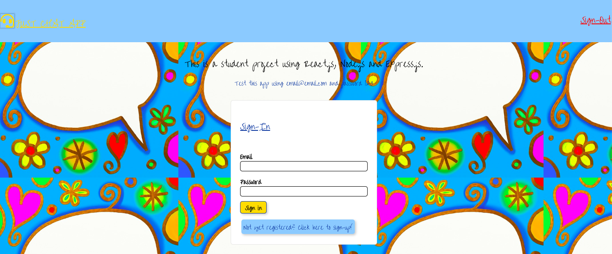

## Just Chat App


## Scaffolding
I like to set up all my project dependencies up front with a check list and ensure the back-end and front-end are connected. I do this in the master branch and then run branches for development of features, bug fixes, etc.

### Front-end libraries
[npx create-react-app]
[npm install tachyons -S] (installs tachyons) A CSS tool-kit for rapid styling (tachy is the Greek word for rapid!) They are responsive based on mobile-first design,  with low-specificity that can be overwritten and excellent documentation [http://tachyons.io/docs/] to experiment with - ideal for quick mock-ups and M
[npm install --save react-tilt] animation in React.js

### Back-end dependencies and libraries
[npm install node nodemon express request-promise cors dotenv -S]
1. [npm install node -S]  (adds node.js)
2. [npm install nodemon -S] (adds hot loading of backend server with nodemon)
3. [npm install express -S] (install express midware - ajax and body-parser inbuilt)
4. [npm install request-promise -S] [npm install request] (sets up back end API to get methods of request-promise from ES-6)
5. [npm install cors] enables cross-origin-resource-sharing, prevents resource blocking
6. [npm install dotenv] enables saving of passwords, files with keys for access

### Connect back-end and front-end
[npm install npm-run-all] - Unless I want to deploy the app - at which stage the package JSOn files and an [npm-run-build] are required I do not set up a proxy server or static files, I merely install dependencies.

## Set up file structure
Compartmentalize the back-end and front-end src files, in the front-end I set up common and app-pages as 2 folders. Common sets up all components that are reusable across multiple pages - nav bars, buttons, search bars, scrolly-bars, etc. The app-pages are purely for the app and all feed into App.js which then feeds into index.js.

The back-end I have server.js to set up the server files with the basic documentation from express
```
const express = require('express');
const app = express();
const port = 3000;

app.listen(port, () => console.log(`chat-app listening on ${port}`));
```
I test to see if this is working. [npm run start-backend] modify scripts file with ``` "start-backend": "nodemon <filepath of server.js>",```

In the front-end I set up an app.js component with a hello-world tag to check it is is compiling, I also add hello world to components in the common folder after that. I test to see if this is working [npm run start] Both servers are on port 3000 at this stage and I do not change this until much later.

### Setting up project structure
I now think of use cases, UI-UX and visualize how the app will look and what React Components I require for the front-end and what I require for the back-end data. This phase is a planning an reflective phase, which if I am working in a group the key things I establish are group goals, group tasks, task-allocation, definition of done, structure of git-hub files, git-master and who resolves file confilicts - processes-procedures.

### Task 1
Initial styling and set up of front-end components - I like to choose fonts, colors, look and feel - images or anything that makes the app stand out from a ux point of view and is easy to navigate from a ui point of view. I like Pixabay for student projects [https://pixabay.com/] this image credit goes to Prawny from Pixabay, the logo icon is from fontawesome.

This quickly sets up the look and feel with some light Tachyon styling and React Tilt, for animation in React. Some cool backgrounds can be found at [lea.verou.me/css3patterns] [https://www.npmjs.com/package/react-particles-js].

With a group student project, each team member can now create their own look and feel for the project by downloading the initial pack with all the dependencies. Or use the one created for the team.

Components created 
- Home 
- About
- Navigation
- Message input
- Submit & Send Button


### Task2 add sign-in and sign-out functionality

Refactoring
- Home Page
- Nav Bar
- App.js
- Submit & Send Button
- Created loginComponent - a form for sign-in

- Home now has a form for sign in and register
- The Navbar now has the logo and signout, sign-in and register incorporated in form
- App.js changed from a functional component - state introduced
- Submit & Send Button removed, incorporated into form

Page functionality - state route set as 'signInForm'
On Route Change function created to set state to the object route 

```
	onRouteChange = (route) => {
		this.setState({ route: route });
	};
```

conditional rendering of components that we want on sign-in and sign-out

```
render() {
		return (
			<div className="just-chat-app">
				<NavComponent onRouteChange={this.onRouteChange} />

				{this.state.route === 'signinForm' ? (
					<div>
						<AboutPage onRouteChange={this.onRouteChange} />
						<LoginComponent onRouteChange={this.onRouteChange} />
					</div>
				) : (
					<div>
						<InputMessageForm />
					</div>
				)}
			</div>
		);
	}
}

```

Child components passed the props ```onRouteChange``` to the form component, so that when the user clicks the submit login-details email and password, the route changes to user logged in ```onClick={() => onRouteChange('userloggedin')}```

The user is now logged-in and when they want to log-out they are taken back to the sign-in page with the prop ```onRouteChange``` passed as an onclick event handler ```onClick={() => onRouteChange('signinForm')}``` to return to the sign-in form.


### Task3 work data-calls from the back-end

Decisions to make - use an API like Twilio or build from scratch with websockets?
Two-way or multi-way communications
Display information behind log-in - input field styling and response field styling
Data - build a data-base, use API data, use data in Node.js module?
Sign-in - authentication process JWT or bcrypt?
User profile - details of how user can create, read, update, delete information on profile - API with jsonPlaceholder? Or db?
If we are bringing in data from the back end and deploy the app we need to set up a proxy-server, if we are going to build a data-base select db - MongoDb, SQL?

```
[npm run build]
Modify scripts

    "scripts": {
    "start": "npm-run-all -s build start-backend",
    "start-frontend": "react-scripts start",
    "start-backend": "nodemon src/back-end/server.js",
    "start-dev": "npm-run-all -p start-frontend start-backend",
    "build": "react-scripts build",
    "test": "react-scripts test",
    "eject": "react-scripts eject"
  },

Add proxy just above es lint and below scripts

 "proxy": "http://localhost:3001",
  "eslintConfig": {
    "extends": "react-app"
  },
```
